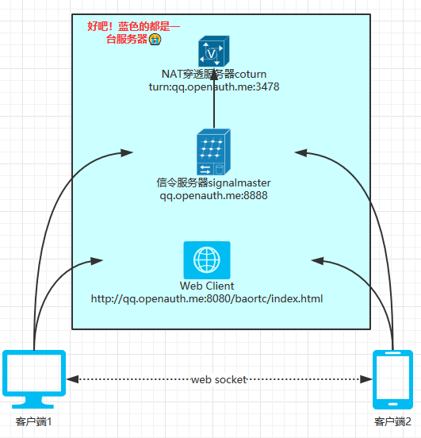
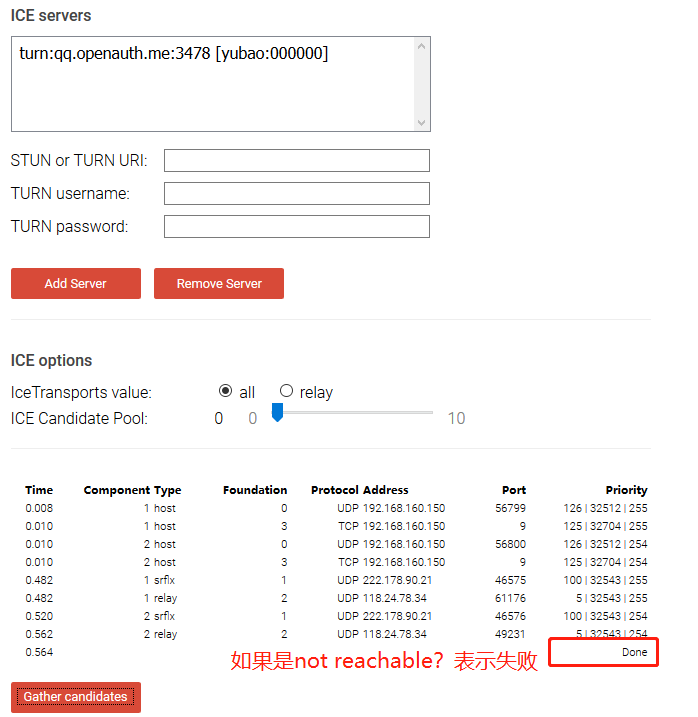
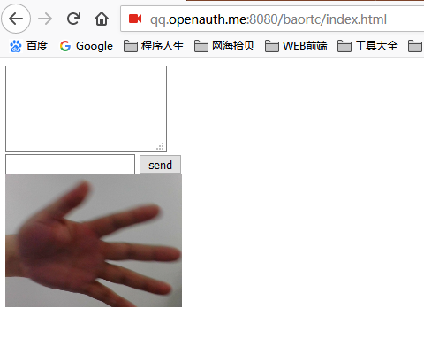
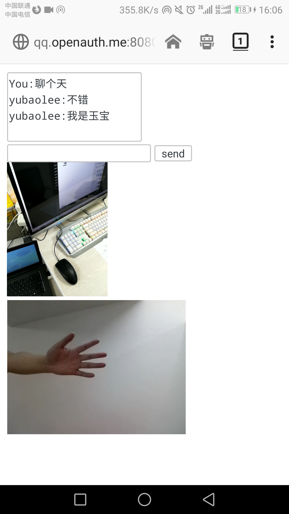

# 5分钟快速打造WebRTC视频聊天 #

百度一下WebRTC，我想也是一堆。本以为用这位朋友（ 搭建WebRtc环境 ）的SkyRTC-demo 就可以一马平川的实现聊天，结果折腾了半天，文本信息都发不出去，更别说视频了。于是自己动手。

想在公网上实现视频通信，需要下面3个核心元素：

1. 一个是NAT穿透服务器(ICE Server)，实现内网穿透，具体的作用可以自行百度。
1. 基于WebSocket的信令服务器(Signaling Server)，用于建立点对点的通道。
1. Web客户端。通过H5的WebRTC特性调用摄像头，进行用户交互。

三个部分的组成如下：

 

蓝色的部分实际部署可以在三台服务器，我这里演示环境都在一台服务器。需要开的端口3478、8888、8080，当然也可以自行配置。下面来详细介绍具体的组合步骤：

**准备工作**

服务器运行环境：centos 7.3

安装工具：nodejs 、git  请自行百度安装

客户端环境：FireFox（或手机版FireFox)。因为chrome需要https支持，服务器需要部署证书。所以演示程序只支持Firefox，如有需要我会再发一篇文章介绍。

**安装NAT穿透服务器（ICE Server）**

实现内网穿透的方式主要有stun,turn两种方式，一般用的时候会把stun,turn的地址都配置上，如果连不上stun，会自动切换到turn服务器。详细介绍可以参考：STUN, TURN, ICE介绍 网上有很多开源的stun服务器，但丫的我一个都没成功过，有兴趣的可以试试：http://blog.sina.com.cn/s/blog_683d26990100oucy.html 我这里就直接使用coturn只搭建turn server，安装命令如下：

    git clone https://github.com/coturn/coturn
    cd coturn
    ./configure
    make
    make install

附：如果./configure失败的话，应该是需要openssl和Libevent2：

    yum install -y openssl openssl-devel
    
    yum -y install libevent-devel

 安装完成后，把example/etc里面的turnserver.conf拷贝到bin文件夹：

    cp examples/etc/turnserver.conf bin/turnserver.conf

修改配置turnserver.conf，如下：

    #监听端口
    listening-port=3478
    
    #阿里云内网IP
    listening-ip=10.214.31.57
    
    #阿里云外网IP地址
    external-ip=118.24.78.34
    #访问的用户、密码
    user=yubao:000000

启动服务：

    cd bin
    turnserver -v -r 118.24.78.34:3478 -a -o

搭建好后可以在 https://webrtc.github.io/samples/src/content/peerconnection/trickle-ice/ 测试一下有没有成功，如下：




也可以在/var/log文件夹中随时查看运行日志，比如我的：

    tail -f /var/log/turn_12447_2018-04-20.log 

**信令服务器(Signaling Server)**

 信令服务器使用的是 signalmaster ，基于websocket。选用它的原因是可以直接集成turn server服务器。

    git clone https://github.com/andyet/signalmaster.git
    cd signalmaster
    npm install express
    npm install yetify
    npm install getconfig
    npm install node-uuid
    npm install socket.io

signalmaster可以连接turnserver，但不支持用户名/密码方式，需要对源码sockets.js 110行进行调整，调整后的代码如下：

```
        if (!config.turnorigins || config.turnorigins.indexOf(origin) !== -1) {
            config.turnservers.forEach(function (server) {
                credentials.push({
                    username: server.username,
                    credential: server.credential,
                    urls: server.urls || server.url
                });
            });
        }
```

完成后，修改config/production.json，配置turnserver的用户和密码，如下：

```
{
  "isDev": true,
  "server": {
    "port": 8888,
    "/* secure */": "/* whether this connects via https */",
    "secure": false,
    "key": null,
    "cert": null,
    "password": null
  },
  "rooms": {
    "/* maxClients */": "/* maximum number of clients per room. 0 = no limit */",
    "maxClients": 0
  },
  "stunservers": [
    {
      "urls": "stun:stun.ekiga.net:3478"
    }
  ],
  "turnservers": [
    {
      "urls": ["turn:qq.openauth.me:3478"],
      "username": "yubao",
      "credential":"000000",  
      "expiry": 86400
    }
  ]
}
```

 启动：

    nohup node server.js &

**Web客户端**

客户端可以快速做一个html的页面，可以参考：一步一步搭建客服系统 (1) 3分钟实现网页版多人文本、视频聊天室 （含完整源码) 当然如果你实在是太懒，直接点击下载吧。可以找个静态的Web服务器，部署上就可以了。注意修改第二部的signal服务器地址：

```
var webrtc = new SimpleWebRTC({

    localVideoEl: 'localVideo',
   
    remoteVideosEl: 'remoteVideos',

    autoRequestMedia: true,

    url:'http://qq.openauth.me:8888',  //配置成自己的signal服务器

    nick: 'yubaolee'   //文本聊天时，用户的昵称

});
```

 我部署的地址：http://qq.openauth.me:8080/baortc/index.html（别随便访问，突然看到我....我会害羞的🙂(✿◡‿◡)），电脑FireFox（chrome安全要求比较高，必须用https，暂时用firefox测试）访问效果：



 

再用另一台电脑或手机firefox访问，可以发现已经有两个视频窗口（刚刚电脑打开的页面也会自动有两个视频窗口），并且可以文本，视频通信：



 自此，一个WebRTC的程序搭建完成。

------

作者：李玉宝（李玉宝的代码人生）

出处：http://www.cnblogs.com/yubaolee/

开源框架：最好用的的权限工作流框架OpenAuth.Net

本作品采用知识共享署名-非商业性使用-禁止演绎 2.5 中国大陆许可协议进行许可。

如您有任何疑问或者授权方面的协商，请给我留言。