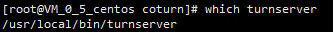
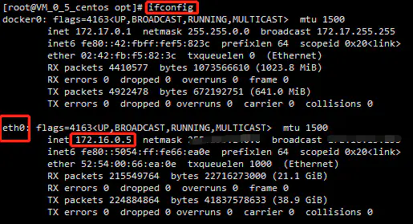
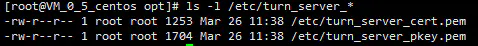
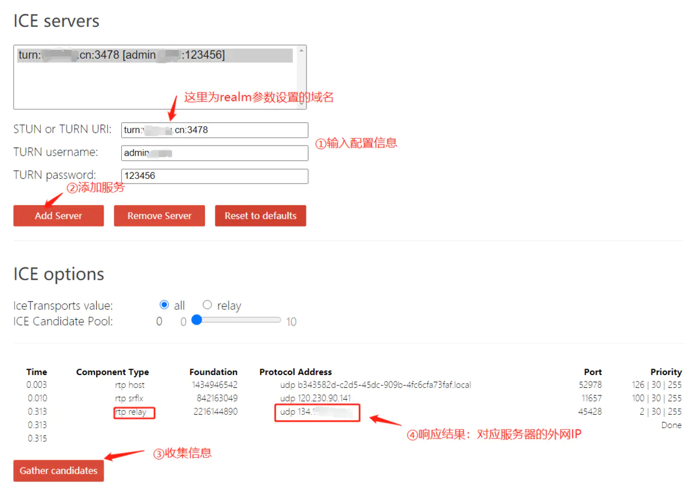
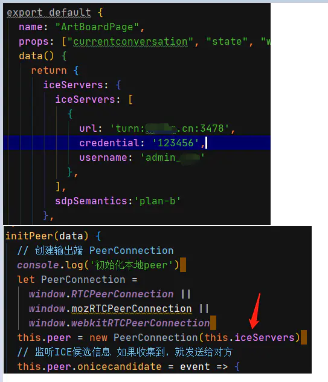

# Centos7.x 搭建coturn服务器 #

## 为什么我要搭建coturn中继服务器？ ##

我的项目里用到了WebRTC技术，没有配置iceServers参数，在本地测试时是可以进行语音通话和白板协作，但是部署到服务器后用2台不同主机进行P2P通话或白板协作，发现无法建立连接。于是网上一搜，发现需要一个公网的中继服务器进行中转，其作用就是通过收集NAT背后的peer端（即：躲在路由器或交换机后的电脑）对外暴露出来的IP和PORT，找到一条可穿透路由器的链路，俗称打洞。stun/turn服务器通常要部署在公网上，能被所有peer端访问到，coturn开源项目同时实现了stun和turn服务的功能，是WebRTC应用的必备首选。

## Centos7.x 搭建coturn服务器教程 ##

安装相关依赖：

	yum install -y make gcc cc gcc-c++ wget openssl-devel libevent libevent-devel openssl 
	yum install git

下载编译安装coturn开源项目，若克隆项目时间较长，可单独到该主页中下载压缩包，然后执行命令：①解压包：unzip coturn-master.zip；②重命名文件夹：mv coturn-master coturn。

	git clone https://github.com/coturn/coturn 
	cd coturn 
	./configure 
	make 
	make install

查看是否安装成功：`which turnserver`


安装成功

将/usr/local/etc/目录下的turnserver.conf.default文件复制一份，文件名为turnserver.conf：

	cd /usr/local/etc/
	cp turnserver.conf.default turnserver.conf

查看网卡，记录网卡名称和内网地址：`ifconfig`



cert和pkey配置的自签名证书用Openssl命令生成，提示的相关信息随便填写即可。

	openssl req -x509 -newkey rsa:2048 -keyout /etc/turn_server_pkey.pem -out /etc/turn_server_cert.pem -days 99999 -nodes 


生成的两个文件在/etc/目录下

修改配置文件信息：vim /usr/local/etc/turnserver.conf

```
# 网卡名
relay-device=eth0
#内网IP
listening-ip=172.16.0.5 
listening-port=3478
#内网IP
relay-ip=172.16.0.5
tls-listening-port=5349
# 外网IP
external-ip=134.xxx.xxx.xxx
relay-threads=500
#打开密码验证
lt-cred-mech
cert=/etc/turn_server_cert.pem
pkey=/etc/turn_server_pkey.pem
min-port=40000
max-port=65535
#设置用户名和密码，创建IceServer时使用
user=admin:123456
# 外网IP绑定的域名
realm=xxxx.cn
# 服务器名称，用于OAuth认证，默认和realm相同，部分浏览器本段不设可能会引发cors错误。
server-name=xxxx.cn
# 认证密码，和前面设置的密码保持一致
cli-password=123456
```

在腾讯云后台的安全组规则添加3478端口的tcp/udp规则，udp一定要配置！

服务器开放端口：3478/udp和3478/tcp：

```
#开放端口
firewall-cmd --zone=public --add-port=3478/udp --permanent
firewall-cmd --zone=public --add-port=3478/tcp --permanent
#刷新防火墙
firewall-cmd --reload
#查看当前开放的端口
firewall-cmd --list-port
```

启动服务：turnserver -o -a -f。备注：turnserver命令会自动寻找到turnserver.conf文件的位置。

终止服务：

	ps -ef | grep turnserver
	kill -9 pid

在线检测ICE穿透的地址：[点我即达](https://links.jianshu.com/go?to=https%3A%2F%2Fwebrtc.github.io%2Fsamples%2Fsrc%2Fcontent%2Fpeerconnection%2Ftrickle-ice%2F)


中继成功

在创建peerConnection对象时传入设定的iceServers参数值即可，若初始化参数中 iceServers 为null时只能创建本地连接。




部署效果图，1v1视频成功

作者：dev_winner

链接：https://www.jianshu.com/p/7e9d0af05396

来源：简书

著作权归作者所有。商业转载请联系作者获得授权，非商业转载请注明出处。