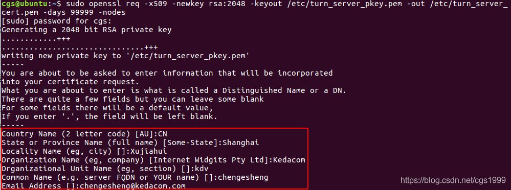
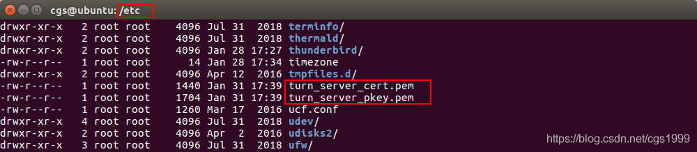
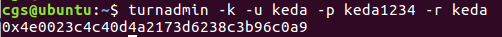
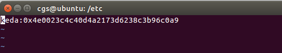
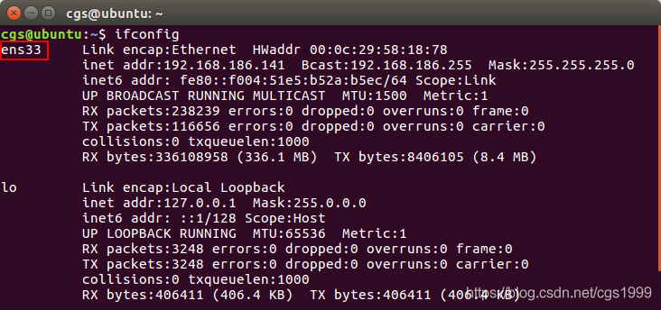
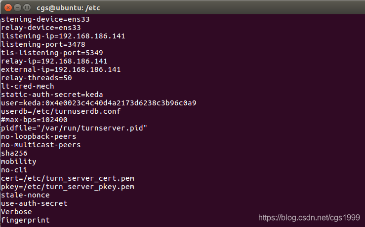
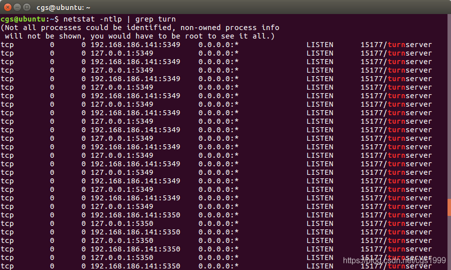
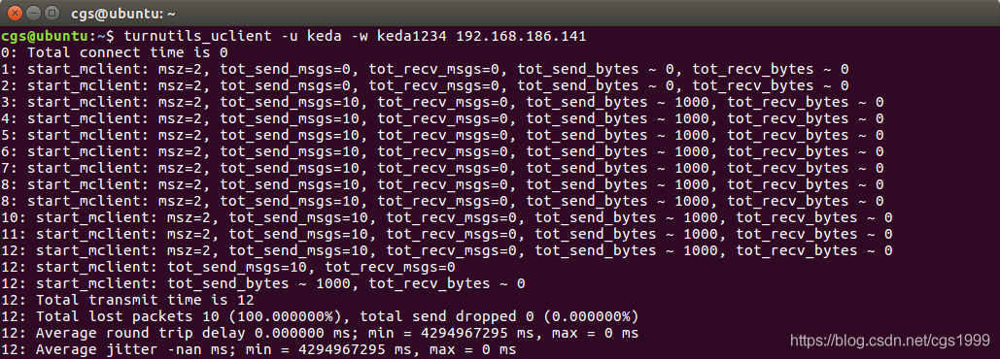

# Ubuntu中搭建ICE服务器（Coturn） #

## 1. WebRTC的P2P穿透 ##

WebRTC的P2P穿透部分是由libjingle实现的.

步骤顺序大概是这样的:

- 尝试直连.
- 通过STUN服务器进行穿透
- 无法穿透则通过TURN服务器中转

STUN服务器比较简单. 网上也有很多公开的STUN服务器可以用于测试，例如： stun.ideasip.com

在WebRTC的P2P应用中，使用公开的STUN服务器时，有时响应比较慢，这就需要自己搭一个ICE服务器即可。ICE服务器包含STUN和TURN两部分，实际上只需要TURN服务器就可以解决P2P的穿透问题。

Coturn是在原来的TurnServer上增加了一些高级特性. (这是作者的描述, 两个项目是同一个作者. 作者更推荐使用Coturn).

- coturn 支持tcp, udp, tls, dtls 连接.
- coturn 支持linux bsd solaris mac os. 暂不支持windows (未来会支持)

## 2. 安装Coturn ##

**2.1 安装依赖组件**

使用下面相关命令安装Coturn依赖的相关库文件

```
sudo apt-get install libssl-dev
sudo apt-get install libevent-dev
sudo apt-get install libpq-dev
sudo apt-get install mysql-client
sudo apt-get install libmysqlclient-dev
sudo apt-get install libhiredis-dev
sudo apt-get install git
```

**2.2 下载编译安装Coturn**

相关命令如下

```
git clone https://github.com/coturn/coturn
cd coturn
./configure
make
sudo make install
```

**2.3 验证Coturn安装**

使用下面命令查看Coturn的安装情况

	which turnserver

如下图所示，可以看到Coturn的turnserver所在的路径，表示安装成功


## 3. 配置Coturn ##

**3.1 创建配置文件**

从默认的配置文件中复制生成Coturn的配置文件 turnserver.conf

	sudo cp /usr/local/etc/turnserver.conf.default /usr/local/etc/turnserver.conf

**3.2 生成SSL证书**

生成服务器使用的SSL证书，相关命令如下所示：

	sudo openssl req -x509 -newkey rsa:2048 -keyout /etc/turn_server_pkey.pem -out /etc/turn_server_cert.pem -days 99999 -nodes

命令相关输入信息可根据需要填写，如下图所示



可以在 /etc 目录下找到生成的两个证书文件，如下图所示



**3.3 简单使用**

至此，就可以直接运行下面的命令进行简单的使用了

	turnserver -o -a -f -v --mobility -m 10 --max-bps=100000 --min-port=32355 --max-port=65535 --user=keda:keda1234 --user=keda2:keda1234 -r keda

其中：

- -m 10 表示启动十个relay线程
- –max-bps=100000 限制最大速度为100KB/s
- 当TURN Server用于WebRTC时，必须使用long-term credential mechanism, 即指定 -a 或者 --lt-cred-mech
- 添加了两个用户：keda和keda2，以及对应的密码

**3.4 自定义设置**

**3.4.1 生成用户Key信息**

从安全性方面考虑，可以为账户生成key, 这样就可以直接通过key登录，而不需要提供密码。

key 通过turnadmin生成, 需要(username, password, realm)，realm是启动turn server时-r 参数指定的。生成用户Key信息，命令格式如下：

	turnadmin -k –u 用户名 -p 密码 -r 域名

例如，用户名=keda、密码=keda1234、域名=keda，则命令如下：

	turnadmin -k –u keda -p keda1234 -r keda

生成的Key信息如下图所示



**3.4.2 创建用户配置文件**

创建用户配置文件turnuserdb.conf，命令如下：

	sudo vi /etc/turnuserdb.conf

在其中填入之前生成的用户名和key



**3.4.3 修改配置文件**

首先，使用 ifconfig 命令查看一下服务器的网卡类型：



其次，修改Coturn的配置文件，相关命令如下所示：

	vi /usr/local/etc/turnserver.conf

配置文件的内容，如下所示：

```
listening-device=填写自己的网卡类型
relay-device=填写自己的网卡类型
listening-ip=ip地址
listening-port=3478
tls-listening-port=5349
relay-ip=ip地址
external-ip=ip地址
relay-threads=50
lt-cred-mech
static-auth-secret=用户名
user=用户名:密钥
userdb=/etc/turnuserdb.conf
#max-bps=102400
pidfile="/var/run/turnserver.pid"
no-loopback-peers
no-multicast-peers
sha256
mobility
no-cli
cert=/etc/turn_server_cert.pem
pkey=/etc/turn_server_pkey.pem
stale-nonce
use-auth-secret
Verbose
fingerprint
```

如下图所示，是虚拟机上的配置：



**3.4.4 运行turnserver**

使用下面命令运行turnserver就可以进行使用了

	sudo turnserver -L 192.168.186.141 -o -a -b /etc/turnuserdb.conf -f -r keda

## 4. 运行并验证 ##

**4.1 查看Turnserver的运行情况**



4.2 验证Turnserver的P2P穿透情况
使用 turnutils_uclient 工具验证Turnserver的P2P穿透情况，相关命令如下：

	turnutils_uclient -u keda -w keda1234 192.168.186.141

执行结果，如下图所示



## 5. 参考资料 ##

coturn(turn)服务器搭建
https://blog.csdn.net/qq_16042523/article/details/52994785

Coturn项目源码
https://github.com/coturn/coturn.git

webrtc学习: 部署stun和turn服务器
http://www.cnblogs.com/lingdhox/p/4209659.html

————————————————

版权声明：本文为CSDN博主「cgs1999」的原创文章，遵循CC 4.0 BY-SA版权协议，转载请附上原文出处链接及本声明。

原文链接：https://blog.csdn.net/cgs1999/article/details/89882164