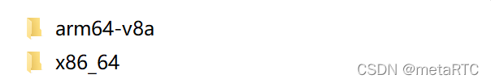
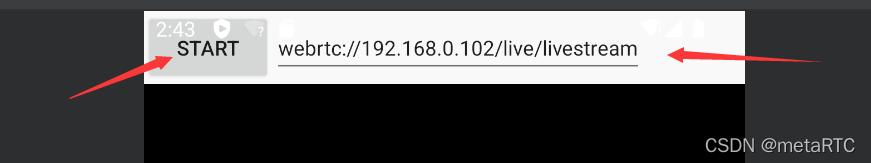

# metaRTC实现安卓webrtc推流直播


[metaRTC](https://blog.csdn.net/m0_56595685/category_11474470.html)

专栏收录该内容

34 篇文章32 订阅

订阅专栏

## 概述 ##

metaRTC新版本开始支持安卓系统，推拉流(直播和播放)流程中拉流、编解码、渲染、音视频采集播放等都在C++类库中进行，减少了因jvm和native流媒体交换降低性能。

## 下载源码 ##

- https://github.com/metartc/metaRTC
- https://github.com/metartc/metaRTC
- metaRTC: metaRTC为嵌入式版本的webrtc
- https://gitee.com/metartc/metaRTC

```
git clone https://github.com/metartc/metaRTC.git
或者
git clone https://gitee.com/metartc/metaRTC.git
```

## 编译 ##

**第三方类库下载**

下面是已经编译好的第三方类库

- metaRTC3.0的android/linxu/windows的第三方类库的二进制文件-直播技术文档类资源-CSDN下载
- metaRTC3.0的android/linxu/windows的第三方类库的二进制文件安卓系统更多下载资源、学习资料请访问CSDN下载频道.
- https://download.csdn.net/download/m0_56595685/85036149

**libx264编译**

编辑build_android.sh脚本

```
#!/bin/sh
export ANDROID_NDK=/home/yang/pro/ndk
API=29

#aarch64 armv7a x86_64
ARCH=aarch64
PLATFORM_PREFIX="x86_64-linux-android-"
HOST=x86_64-linux-android
PLATFORM_VERSION=4.9
if [ "$ARCH" = "aarch64" ] ;then
    PLATFORM_PREFIX="aarch64-linux-android-"
    HOST=aarch64-linux-android
fi
if [ "$ARCH" = "armv7a" ];then
    PLATFORM_PREFIX="armv7a-linux-androideabi-" 
    HOST=arm-linux-androideabi 
fi

SYSROOT=$ANDROID_NDK/toolchains/llvm/prebuilt/linux-x86_64/sysroot
TOOLCHAIN=$ANDROID_NDK/toolchains/llvm/prebuilt/linux-x86_64

export CC=$TOOLCHAIN/bin/${ARCH}-linux-android${API}-clang
export CXX=$TOOLCHAIN/bin/${ARCH}-linux-android${API}-clang++

CROSS_PREFIX=$TOOLCHAIN/bin/${PLATFORM_PREFIX}
ADDITIONAL_CONFIGURE_FLAG="-march=$ARCH"
    ./configure \
    --cross-prefix=$CROSS_PREFIX \
    --sysroot=$SYSROOT \
    --enable-static \
    --enable-pic \
    --host=${HOST} \
    --disable-cli \
    --bit-depth=8

# --disable-asm

make clean
make
```

**openssl编译**

```
export ANDROID_NDK=/home/yang/ndk
export PATH=$ANDROID_NDK/toolchains/llvm/prebuilt/linux-x86_64/bin:$PATH
#android-arm64 android-armeabi android-x86_64
./Configure android-arm64 -D__ANDROID_API__=29
make
```

**opus/libyuv/srtp编译**

```
mkdir build
cd build
#ndk目录
export NDK_ROOT=/home/yang/ndk
#arm64-v8a armeabi x86_64
cmake -G"Unix Makefiles" -DCMAKE_TOOLCHAIN_FILE=$NDK_ROOT/build/cmake/android.toolchain.cmake -DANDROID_NDK=$NDK_ROOT -DCMAKE_SYSTEM_NAME=Android -DANDROID_PLATFORM=android-29 -DCMAKE_BUILD_TYPE=Release -DANDROID_ABI=arm64-v8a -DAndroid=ON -DANDROID_STL=c++_static -DCMAKE_CXX_STANDARD=11 -DANDROID_NATIVE_API_LEVEL=29 ..
make
```

**libspeexdsp编译**

    cd metaspeexdsp
    ./cmake_android.sh

**libmetartccore3和libmetartc编译**

    cd libmetartccore3
    ./cmake_android.sh

    cd libmetartc3
    ./cmake_android.sh

编译后lib文件在bin/lib_android目录下



 然后将libmetartccore3.a和libmetartc3.a拷贝到对应的ABI目录下

**推流metapushstream3_android编译**

用studio打开工程metapushstream3_android编译



 输入srs或者zlm地址，然后点击按钮start就可以播放webrtc

## 流媒体和编码器选择 ##

metaRTC流媒体支持srs和zlm，编码器支持软硬编码器libx264/libx265和mediacodec

在工程metapushstream3_android中native-lib.cpp文件中

```
void g_push_initContext(YangContext* context){
    context->avinfo.rtc.mixAvqueue=0;
//选择流媒体
    context->avinfo.sys.mediaServer=Yang_Server_Srs;//Yang_Server_Srs/Yang_Server_Zlm
    context->avinfo.video.videoEncoderType=Yang_VED_264;
    context->avinfo.video.videoEncoderFormat=YangI420;
//选择编码器 libx264和mediacodec
    //YangV_Hw_Android mediacodec
    //Yang_Hw_Soft libx264
    context->avinfo.video.videoEncHwType=Yang_Hw_Soft;

    context->avinfo.audio.usingMono=0;
    context->avinfo.audio.sample=48000;
    context->avinfo.audio.channel=2;
    context->avinfo.audio.hasAec=0;
    context->avinfo.audio.audioCacheNum=8;
    context->avinfo.audio.audioCacheSize=8;
    context->avinfo.audio.audioPlayCacheNum=8;
    
    context->avinfo.video.videoCacheNum=10;
    context->avinfo.video.evideoCacheNum=10;
    context->avinfo.video.videoPlayCacheNum=10;
    
    context->avinfo.audio.audioEncoderType=Yang_AED_OPUS;
    context->avinfo.sys.rtcLocalPort=17000;
    context->avinfo.enc.enc_threads=4;
    context->avinfo.enc.createMeta=0;
    
    yang_setLogLevle(5);
    yang_setLogFile(1);
```

————————————————

版权声明：本文为CSDN博主「metaRTC」的原创文章，遵循CC 4.0 BY-SA版权协议，转载请附上原文出处链接及本声明。

原文链接：https://blog.csdn.net/m0_56595685/article/details/123657024
