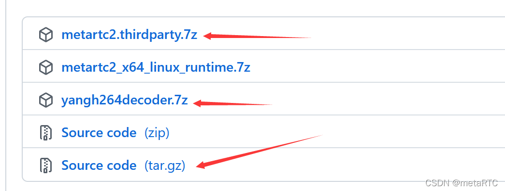
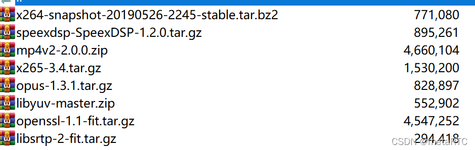

# metaRTC嵌入式webrtc编译指南 #

## 概述 ##

开源项目编译和适配对于很多开发者来说是个难关，大部分开发者都被卡在这一步。metaRTC适用于嵌入式开发，但嵌入式环境多样性是个挑战，要适应X86、ARM、MIPS、RISC-V等多种架构，我们会努力加强编译易用性。

metaRTC编译支持qmake和cmake，qmake使用QT最为方便，新版本又新增了cmake支持，cmake的支持要感谢网友醉生梦死的贡献。

## 下载源码 ##

    https://github.com/metartc/metaRTC/releases/tag/2.0.070
    https://github.com/metartc/metaRTC/releases/tag/2.0.070
    https://gitee.com/metartc/metaRTC/releases/2.0.070
    https://gitee.com/metartc/metaRTC/releases/2.0.070

metartc2.thirdparty.7z为第三方库源代码，yangh264decoder.7z为精简的ffmpeg h264解码库

## 编译 ##

**libmetartc cmake编译**

下载源码和第三方类库后，进入工程libmetartc2目录，默认为debug。

mkdir build

cd build

cmake .. -DCMAKE_BUILD_TYPE=Release

make

生成的库文件libmetartc2.a和libmetartc2.so就在build文件夹里，静态库2Mb多，动态库1Mb多。

**QT编译**

用QT载入libmetartc2工程，直接编译即可。

编译后文件在bin/lib_debug或者bin/lib_release目录下。

拉流demo QT版本：metaplayer2

推流demo QT版本：metapushstream2

用QT载入工程metaplayer2和metapushstream2，编译libmetartc2后，再编译这两个工程即可。

## 第三方库编译 ##

**yangh264decoder编译**

解压yangh264decoder.7z，进入源码文件夹

新建文件夹 mkdir build

cd build

cmake ..

make

**其他第三方库编译**

第三方库在metartc2.thirdparty.7z

第三方基本库：openssl,libsrtp2,opus

第三方编码库：x264,x265,libyuv(可选）

第三方AEC等音频库：speexdsp

第三方mp4录制（h264/h265）库：mp4v2

编译：

./configure

make

make install

————————————————

版权声明：本文为CSDN博主「metaRTC」的原创文章，遵循CC 4.0 BY-SA版权协议，转载请附上原文出处链接及本声明。

原文链接：https://blog.csdn.net/m0_56595685/article/details/122139482