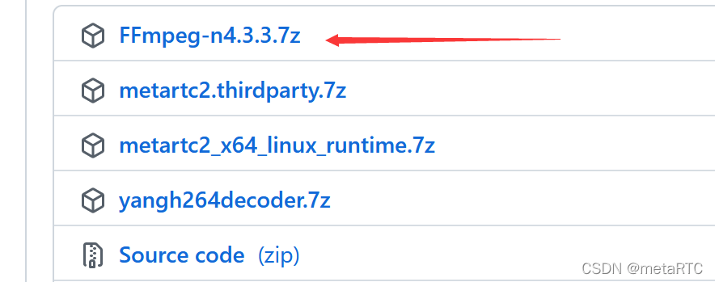
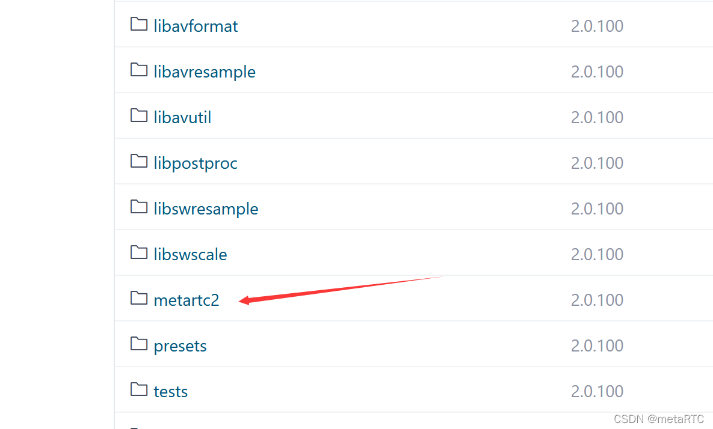
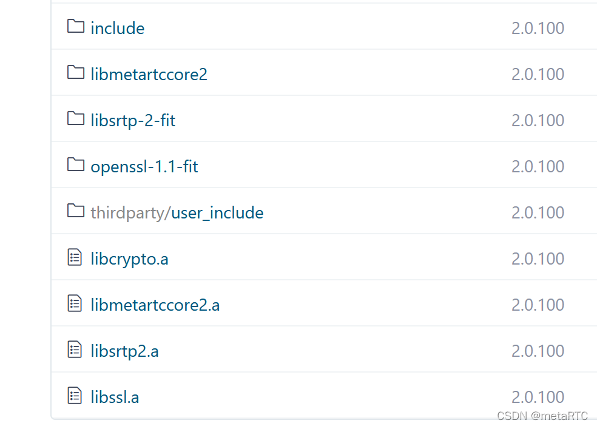
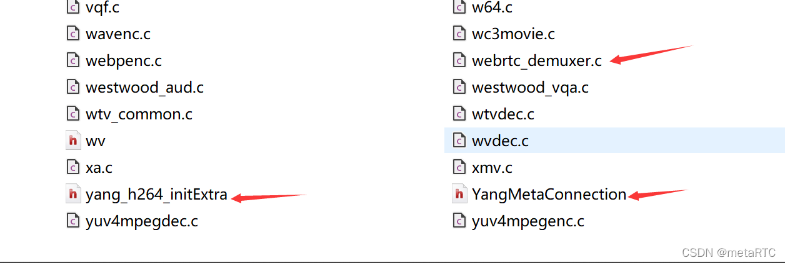

# metaRTC集成到ffmpeg实现srs的webrtc拉流播放 #

## 概述 ##

ffmpeg是一个强大的音视频处理软件，处理各种音视频的编解码和传输等，里面还集成有ffplay播放器等。metaRTC新版本支持静态编译集成到ffmpeg，使ffmpeg支持webrtc。

## 下载源码 ##

    https://github.com/metartc/metaRTC/releases/tag/2.0.100
    https://github.com/metartc/metaRTC/releases/tag/2.0.100
    https://gitee.com/metartc/metaRTC/releases/2.0.100
    https://gitee.com/metartc/metaRTC/releases/2.0.100

ffmpeg-n4.3.3.7z为集成metaRTC的ffmpeg。

也可以

	git clone https://github.com/metartc/ffmpeg-metart

	git clone https://gitee.com/metartc/ffmpeg-metart

## 编译 ##

在目录metartc2里面编译openssl、srtp、libmetartccore2

编译可参考

[metaRTC嵌入式webrtc编译指南_m0_56595685的博客-CSDN博客](https://blog.csdn.net/m0_56595685/article/details/122139482)

编译后将编译的二进制文件放到metartc2目录下

然后执行

	sh metaconfig.sh

	make

	sudo make install

	ffplay webrtc://127.0.0.1/live/livestream

metaconfig.sh文件命令是

	./configure --extra-libs='-L$PWD/metartc2 -lmetartccore2 -lpthread -lsrtp2 -lssl -lcrypto -ldl'

## 集成说明 ##

新增文件：

	libavformat/webrtc_demuxer.c

	libavformat/yang_h264_initExtra.h

	libavformat/YangMetaConnection.h //metaRTC头文件

修改文件：

	libavformat/util.c

	libavcodec/h264dec.c

修改部分有//add metartc注释

 

## srs服务器 ##

推荐Srs4.0，下载编译参考http://github.com/ossrs/srs#usage

​	objs/srs -c conf/https.rtc.conf

可支持webrtc/rtmp/hls/srt/httpflv等直播。

————————————————

版权声明：本文为CSDN博主「metaRTC」的原创文章，遵循CC 4.0 BY-SA版权协议，转载请附上原文出处链接及本声明。

原文链接：https://blog.csdn.net/m0_56595685/article/details/122594797