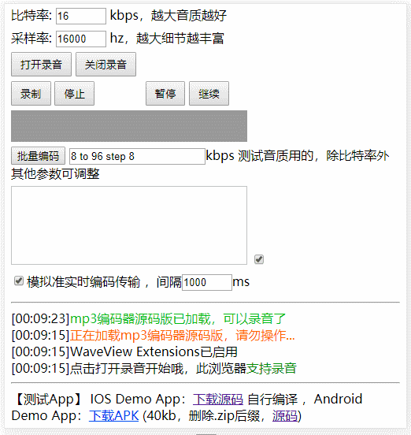
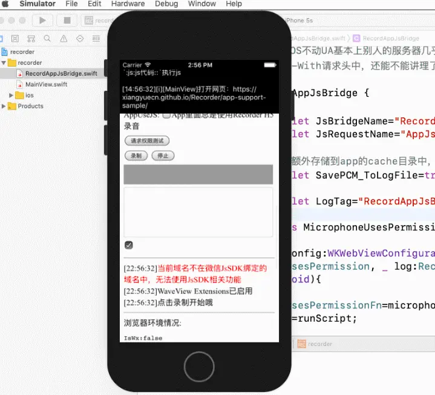
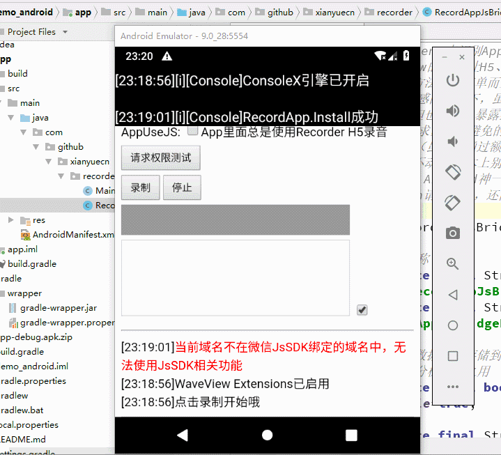

# 优化Recorder H5录音：可边录边转码上传服务器，支持微信提供Android IOS Hybrid App源码 #

> Recorder H5 GitHub开源库随着支持功能的增多，音频转码处理效率渐渐的跟不上需求了，近期抽时间对音频转码部分进行了升级优化，以支持更多实用的功能。
> 
> 另外IOS的Hybrid App也完成了移植，Android和IOS都有了Demo App。
>
> 在线测试，GitHub地址：https://github.com/xiangyuecn/Recorder

## 一、Recorder H5录音库的特性 ##

**（1）浏览器支持**

- PC：包括但不限于Chrome、Firefox
- Android：Chrome、Firefox、Android WebView、腾讯Android X5内核(QQ、微信) （不支持UC系列浏览器，如：UC、支付宝、大部分国产手机厂商的浏览器）
- IOS：Safari，微信(JsSDK)
- Hybrid App：提供Android、IOS端App的JsBridge接口进行对接即可

**（2）功能支持**

- 已提供mp3 wav ogg(beta) webm(beta) amr(beta)格式支持，支持任意格式扩展
- 提供实时音量反馈
- 提供一个美观的实时波形绘制扩展插件
- 录音权限请求和录音功能分开设计，可先请求权限，在需要的时候开始录音
- mp3格式录音文件默认2kb大小/秒，语音音质尚可，再降低音质可小到1kb/秒
- 【新】 mp3 wav格式转码“迅速”，结束录音时几乎可立即得到音频文件，另外可实现边录边转码成小语音片段文件实时上传服务器
- 提供功能丰富的Demo，支持浏览器在线测试，【新】 提供Android(15+) Hybrid App安装包和源码，【新】 提供IOS(9.0+) Hybrid App源码供自行编译

## 二、使用预览截图 ##

**（1）移动端H5**

移动端H5

**（2）IOS Hybrid App**

IOS Hybrid App

（3）Android Hybrid App

Android Hybrid App

## 三、应用场景 ##

- 移动端、PC端H5录音
- 移动端、PC端H5发送语音
- 移动端、PC端H5语音识别
- 移动端、PC端H5语音聊天

## 四、优化过程记录 ##

**（1）为什么要升级优化**

最开始写Recorder的时候，只追求简短的语音录制，因此采用的是录音结束后一次性进行异步（setTimeout分片）转码，1分钟语音在pc端转码MP3花费100-300ms，移动端花费600-1500ms，体验上延迟不算大，并且代码逻辑很简单；如果使用Web Worker（多线程），几乎可以做到没有延迟，但代码似乎会复杂很多，就没有采用。

后面实际使用过程中发现：

稍微长点的语音转码移动端非常吃力，2、3分钟的语音要花费5、10秒进行MP3转码；
进行实时转码发送给服务器时，除了wav格式本身编码非常迅速外，其他格式一律会导致录音卡顿，原因是编码占用了太多的时间，编码期间的录音数据无法正常接收。
基于以上两点问题，似乎只有Web Worker（多线程）能够解决。

**（2）开始使用Web Worker加速转码**

“加速”是要加引号的，其实开启了Web Worker支持，转码速度还是一样的速度，只是转码工作放到了后台线程，不占用页面的时间而已。

但可以做到边录音边转码，不需要等到录音结束时扎堆转码，结果就是不管录制的语音有多长，结束录音时转码都是瞬间完成的。

也可以完美的做到实时进行转码成小语音片段文件上传到服务器，因为转码不占用网页的时间了，录音可以正常的接收数据，不会产生卡顿。

**（3）剩下的问题**

要支持边录边转码，并非仅仅开启Web Worker支持就可以了，还必须要有音频编码器的支持。如果编码器只能将完整的PCM数据一次性的转码成音频文件，那么就需要修改编码器源码，用来支持流式的转码，来一段PCM转一段。

还好库里的MP3编码器是支持流式的，不需要改动就能用；不过其他的格式不改编码器源码似乎无法去支持；wav格式除外，wav编码速度出奇的快，不用优化也是没有问题的。

因此目前MP3格式使用了Web Worker，MP3和wav格式都支持边录边转码，其他格式依旧是结束录音时异步（setTimeout分片）转码。

## 五、Hybrid App存在的意义 ##

本身是无意义的（或者说纯粹是多余的），但无奈IOS各种不支持：非官方浏览器不支持、App内WebView不支持，但Android又各种都支持，本来纯粹的H5一把梭（包括在Hybrid App中）是最方便的，苹果要拖后腿也没办法。

因此仅需在IOS的Hybrid App上做兼容即可，但考虑到简化js端的复杂性（出问题了好甩锅），不管是Android还是IOS都实现一下可能会简单很多；另外Android和IOS的音频编码并非易事，且不易更新，使用js版的音频转码可大大简化App的逻辑；所以Android端也提供Hybrid App支持。

## 六、更多支持 ##

GitHub仓库内有所有的源代码，有详细的使用介绍和Demo，有使用交流群，如果使用过程中有什么问题可以提issue或发消息。要是能打赏支持就更好了，仓库内有二维码。哈哈嘿~ GitHub地址：https://github.com/xiangyuecn/Recorder

作者：高坚果兄弟

链接：https://www.jianshu.com/p/f09aca1121b0

来源：简书

著作权归作者所有。商业转载请联系作者获得授权，非商业转载请注明出处。