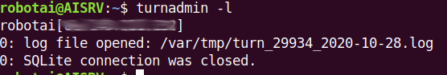
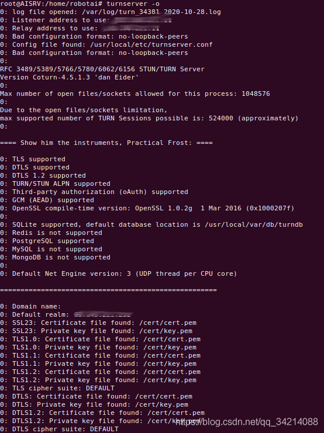
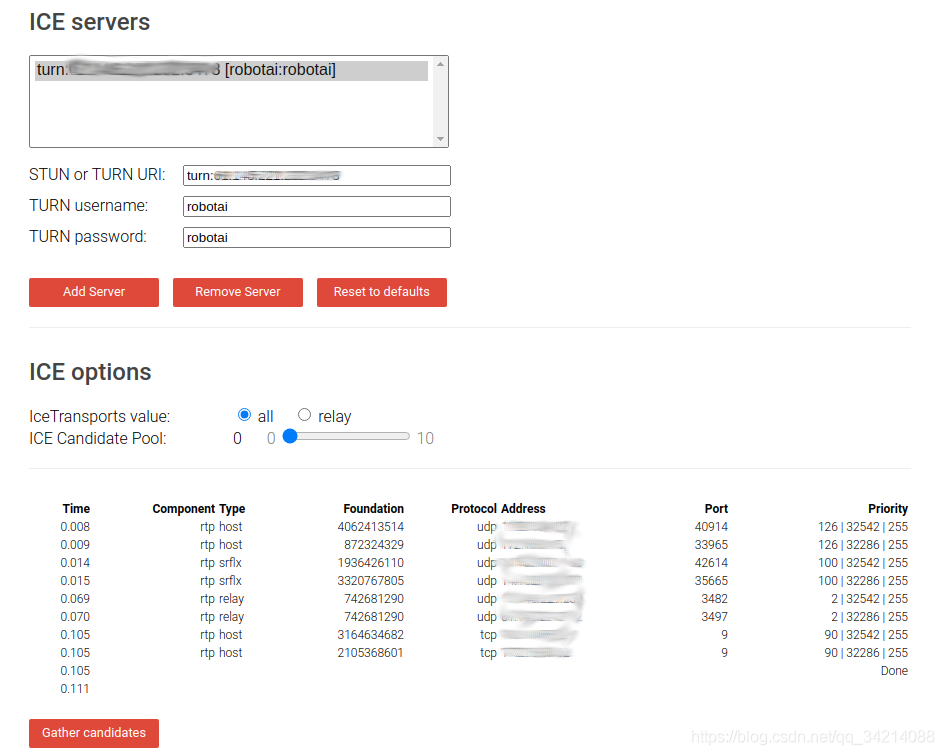

# 搭建turnserver服务器 #

原理：https://zhuanlan.zhihu.com/p/71025431

搭建Coturn服务器

一、生成ssl证书

生成自签名ssl证书即可

```
$ apt install openssl
$ cd /
$ mkdir cert
$ cd cert
$ openssl req -x509 -newkey rsa:2048 -keyout key.pem -out /cert/cert.pem -days 99999 -nodes
```

一、安装依赖库–libevent library

```
$ wget https://github.com/libevent/libevent/releases/download/release-2.1.12-stable/libevent-2.1.12-stable.tar.gz
$ tar -zxvf libevent-2.1.12-stable
$ cd libevent-2.1.12-stable
$ ./config
make
make install
```

二、安装Coturn

```
$ git clone https://github.com/coturn/coturn.git
$ cd coturn
$ ./config
$ make
$ make install
```

三、turnserver数据库配置

```
$ turnadmin -a -u robotai -p robotai -r X.X.X.X //-u 用户名 -p 密码 -r 外网ip
$ turnadmin -l //查看是否添加成功
```

如果添加成功，如下图所示：



四、修改turnserver配置文件

1、查看设备名称及内网ip

	$ ifconfig

2、在/usr/local/etc目录下有turnserver配置文件模板/usr/local/etc/turnserver.conf.default，配置自己的

turnserver.conf ：

```
listening-device=ens1f0 //设备名称
relay-device=ens1f0 //设备名称
listening-ip=#.#.#.# //内网ip
listening-port=3478 //端口
tls-listening-port=9000
relay-ip=#.#.#.# //内网ip
external-ip=X.X.X.X //外网ip
relay-threads=50
min-port=3480
max-port=3500
lt-cred-mech
Verbose
fingerprint
cert=/cert/cert.pem //ssl 公钥
pkey=/cert/key.pem  //ssl 私钥
realm=X.X.X.X //外网ip
no-loopback-peers
no-multicast-peers
mobility
no-cli
```

六、启动turnserver 并测试

1、启动

	$ turnserver -o //-o表示后台运行



2、测试

浏览器打开https://webrtc.github.io/samples/src/content/peerconnection/trickle-ice/

输入 turn:ip:port、用户名、密码，点击Add Server，再点击Gather candidates收集候选地址,最后出现Done，表示完成穿透。



3、如果需要重启，先查看turnserver服务运行PID，然后再kill， 再重启

```
$ netstat -anp|grep turnserver //假设执行后查看到PID为123
$ kill 123
$ turnserver -o
```

————————————————

版权声明：本文为CSDN博主「qq_34214088」的原创文章，遵循CC 4.0 BY-SA版权协议，转载请附上原文出处链接及本声明。

原文链接：https://blog.csdn.net/qq_34214088/article/details/111631951